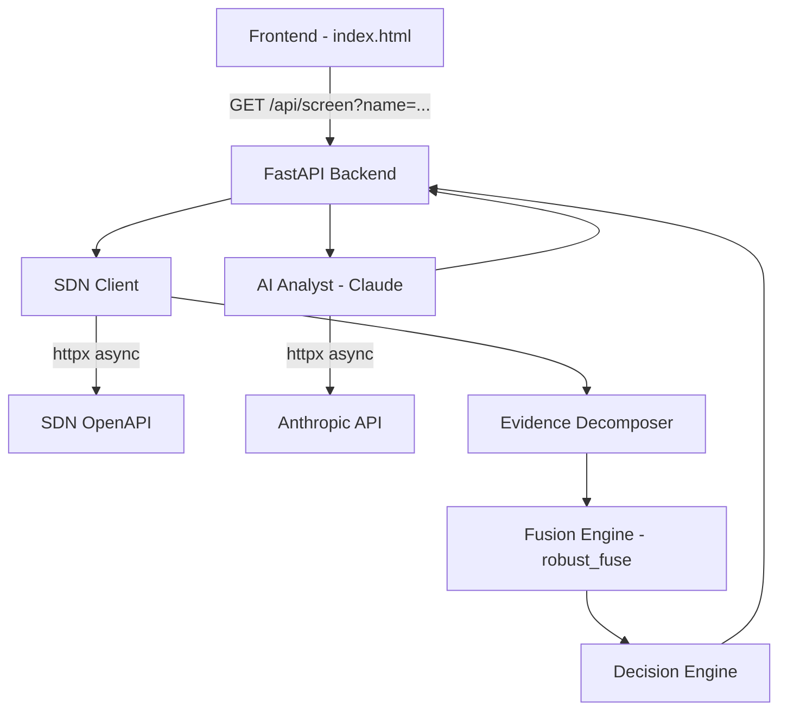

# Design Document: Compliance Screening

## Overview

ED-209 is a hackathon-grade compliance screening system that replaces binary pass/fail sanctions matching with uncertainty-aware Subjective Logic opinions. The system takes an entity name (plus optional country and type), queries the live OFAC SDN list, decomposes the match into 5 independent evidence dimensions, models each as a Subjective Logic Opinion using the jsonld-ex library, fuses them via robust fusion, and renders one of four decisions: AUTO_CLEAR, ESCALATE, AUTO_BLOCK, or GATHER_MORE.

The key insight: traditional systems collapse "strong match," "probably not a match but insufficient data," and "conflicting evidence" into a single fuzzy score. ED-209 distinguishes these states explicitly via the (belief, disbelief, uncertainty) triple.

## Architecture



The system is a single FastAPI application (`backend/app.py`) with clearly separated concerns as functions/modules within one file. No database, no auth, no deployment complexity.

### Request Flow

1. Frontend sends `GET /api/screen?name={name}&country={country}&entity_type={type}`
2. Backend queries SDN OpenAPI via httpx → returns `(results, sdn_available)`
3. If `sdn_available=False` → use vacuous opinions `(0, 0, 1)` for all dimensions → decision GATHER_MORE (API down, don't auto-clear)
4. If `sdn_available=True` and zero hits → return pre-built no-match Opinion `(0.02, 0.78, 0.20)`, decision AUTO_CLEAR, skip decomposition
5. If hits exist → take top match, decompose into 5 evidence Opinions
6. Fuse 5 Opinions via `robust_fuse()` with outlier removal
7. Compute `pairwise_conflict()` across all pairs to detect disagreement
8. Map fused Opinion to decision via threshold logic
9. Call Claude for 3-sentence risk narrative AFTER SDN results are available (Claude needs the matches as input). Graceful fallback on error.
10. Compute binary comparison (score >= 0.65 threshold → FLAGGED/CLEARED)
11. Return full JSON response

## Components and Interfaces

### 1. API Layer (`backend/app.py`)

```python
from fastapi import FastAPI, Query
from fastapi.middleware.cors import CORSMiddleware

app = FastAPI()
app.add_middleware(CORSMiddleware, allow_origins=["*"], allow_methods=["*"], allow_headers=["*"])

@app.get("/api/screen")
async def screen(
    name: str = Query(..., min_length=1, max_length=256),
    country: str = Query(default="Unknown"),
    entity_type: str = Query(default="individual")
) -> ScreeningResponse: ...

@app.get("/api/screen/decay")
async def screen_with_decay(
    name: str = Query(..., min_length=1, max_length=256),
    country: str = Query(default="Unknown"),
    entity_type: str = Query(default="individual"),
    days_since_screening: int = Query(default=0, ge=0)
) -> ScreeningResponse: ...

@app.get("/api/health")
async def health() -> dict: ...
```

### 2. SDN Client

```python
import httpx

SDN_API_URL = "https://sdn-openapi.netlify.app/api/search"

async def query_sdn(name: str) -> tuple[list[dict], bool]:
    """Query SDN OpenAPI. Returns (results, sdn_available).
    
    If sdn_available is False, caller should use vacuous opinions (0,0,1)
    instead of the no-match fast path. This distinguishes "no matches found"
    from "API is down" — critical for compliance safety.
    """
    try:
        async with httpx.AsyncClient(timeout=10.0) as client:
            response = await client.get(SDN_API_URL, params={"q": name})
            response.raise_for_status()
            return response.json().get("results", []), True
    except Exception as e:
        logging.error(f"SDN API error: {e}")
        return [], False
```

### 3. Evidence Decomposer

Converts a top SDN match + screening context into 5 independent Opinion objects:

| Dimension | Logic |
|-----------|-------|
| `name_similarity` | score >= 0.95 → (0.80, 0.05, 0.15); >= 0.85 → (0.55, 0.15, 0.30); >= 0.70 → (0.30, 0.25, 0.45); < 0.70 → (0.15, 0.35, 0.50) |
| `entity_type` | match → (0.50, 0.10, 0.40); mismatch → (0.05, 0.70, 0.25); missing → (0.0, 0.0, 1.0) |
| `geography` | match → (0.60, 0.05, 0.35); mismatch → (0.05, 0.65, 0.30); missing → (0.0, 0.0, 1.0) |
| `program_severity` | SDGT/WMD/NPWMD/IRAN/DPRK/SYRIA → (0.30, 0.10, 0.60); other → (0.15, 0.15, 0.70); missing → (0.0, 0.0, 1.0) |
| `alias_coverage` | 3+ hits AND 2nd score > 0.75 → (0.55, 0.10, 0.35); 2+ hits AND 2nd score > 0.60 → (0.35, 0.20, 0.45); 1 hit or weak 2nd → (0.15, 0.25, 0.60); zero hits → (0.0, 0.70, 0.30) |

```python
from jsonld_ex import Opinion

def decompose_evidence(
    top_match: dict,
    all_matches: list[dict],
    screened_country: str,
    screened_type: str
) -> dict[str, Opinion]:
    """Returns dict mapping dimension name to Opinion."""
    ...
```

### 4. Fusion Engine

```python
from itertools import combinations
from jsonld_ex import robust_fuse, pairwise_conflict

def fuse_opinions(opinions: list[Opinion]) -> tuple[Opinion, list]:
    """Fuse list of Opinions using robust_fuse (outlier removal).
    
    robust_fuse() returns a tuple: (fused_opinion, removed_list)
    where removed_list contains the outlier Opinions that were excluded.
    """
    fused_opinion, removed = robust_fuse(opinions)
    return fused_opinion, removed

def compute_conflict(opinions: list[Opinion]) -> float:
    """Compute max pairwise conflict score between evidence dimensions.
    
    pairwise_conflict() takes exactly TWO Opinions, not a list.
    We call it across all pairs and return the maximum.
    """
    if len(opinions) < 2:
        return 0.0
    conflicts = [
        pairwise_conflict(a, b)
        for a, b in combinations(opinions, 2)
    ]
    return max(conflicts)
```

### 5. Decision Engine

```python
def decide(opinion: Opinion) -> str:
    """Map fused Opinion to decision string."""
    b, d, u = opinion.belief, opinion.disbelief, opinion.uncertainty
    if b >= 0.6 and u <= 0.25:
        return "AUTO_BLOCK"
    if b >= 0.35 and u > 0.25:
        return "ESCALATE"
    if d >= 0.45 and u <= 0.35:
        return "AUTO_CLEAR"
    return "GATHER_MORE"
```

Decision thresholds are evaluated in order: AUTO_BLOCK → ESCALATE → AUTO_CLEAR → GATHER_MORE (fallback).

### 6. AI Analyst

```python
import anthropic

async def generate_risk_assessment(
    entity_name: str,
    sdn_matches: list[dict],
    fused_opinion: Opinion,
    decision: str
) -> str:
    """Call Claude for 3-sentence risk narrative. Returns fallback string on failure."""
    ...
```

### 7. Binary Comparison

```python
BINARY_THRESHOLD = 0.65

def binary_decision(top_score: float | None) -> dict:
    """What a traditional system would decide with a simple threshold."""
    if top_score is None:
        return {"score": 0.0, "decision": "CLEAR", "threshold": BINARY_THRESHOLD}
    return {
        "score": top_score,
        "decision": "FLAGGED" if top_score >= BINARY_THRESHOLD else "CLEAR",
        "threshold": BINARY_THRESHOLD
    }
```

### 8. Decay Endpoint

```python
from jsonld_ex import decay_opinion

HALF_LIFE_DAYS = 14
HALF_LIFE_SECONDS = HALF_LIFE_DAYS * 86400  # 1,209,600 seconds

def apply_decay(opinion: Opinion, days: int) -> Opinion:
    """Apply exponential decay with 14-day half-life.
    
    decay_opinion() takes elapsed_seconds and half_life_seconds (not days).
    We convert days to seconds before calling. Use keyword args for safety.
    """
    return decay_opinion(
        opinion,
        elapsed_seconds=days * 86400,
        half_life_seconds=HALF_LIFE_SECONDS,
    )
```


### 9. Frontend (`frontend/index.html`)

Single HTML file with inline CSS/JS. Dark enterprise theme (#06080d background). Calls `GET /api/screen` on the backend. Displays:
- Search bar with country/type dropdowns and quick-search chips
- Status bar with colored decision dot
- Projected probability card (large monospace number)
- 5 evidence cards with SVG ring gauges
- SDN matches table
- AI risk assessment card with typing animation
- Binary vs ED-209 comparison card (the visual punchline)

No framework, no build step. Loads Inter + JetBrains Mono from Google Fonts CDN.

## Data Models

### ScreeningResponse (API Response Schema)

Per Requirement 17, the response follows this exact contract:

```python
from pydantic import BaseModel
from typing import Optional

class EvidenceOpinion(BaseModel):
    b: float           # belief 0.0 - 1.0
    d: float           # disbelief 0.0 - 1.0
    u: float           # uncertainty 0.0 - 1.0
    projected: float   # projected probability = b + 0.5 * u (SL formula with default base rate 0.5)
    label: str         # human-readable dimension name
    note: str          # description of input data

class FusedOpinion(BaseModel):
    b: float
    d: float
    u: float
    projected: float   # projected probability = b + 0.5 * u

class DecisionResult(BaseModel):
    action: str        # AUTO_CLEAR | ESCALATE | AUTO_BLOCK | GATHER_MORE
    color: str         # green | red | amber | blue
    label: str         # human-readable decision label

class SDNMatch(BaseModel):
    name: str
    type: str
    score: float
    program: str

class BinaryComparison(BaseModel):
    best_fuzzy_score: float
    threshold: float   # 0.65
    binary_decision: str  # "FLAGGED" or "CLEARED"
    our_decision: str     # the ED-209 decision
    difference: str       # human-readable comparison

class ScreeningResponse(BaseModel):
    entity: str
    entity_type: str
    country: str
    sdn_hits: int
    sdn_results: list[SDNMatch]
    evidence: dict[str, EvidenceOpinion]  # keyed by dimension name
    fused: FusedOpinion
    decision: DecisionResult
    conflict_score: float
    outliers_removed: int
    binary_comparison: BinaryComparison
    ai_assessment: str
    latency_ms: int
```

### Opinion Serialization

Evidence opinions are serialized with short keys matching the response contract:
```json
{
  "b": 0.45,
  "d": 0.30,
  "u": 0.25,
  "projected": 45.0,
  "label": "Name Similarity",
  "note": "SDN score: 0.87"
}
```

Constraint: `b + d + u == 1.0` (within tolerance of 0.001).

### No-Match Fast Path

When SDN returns zero hits, skip evidence decomposition and use the pre-built no-match Opinion:
```json
{
  "entity": "Brian Brackeen",
  "entity_type": "individual",
  "country": "United States",
  "sdn_hits": 0,
  "sdn_results": [],
  "evidence": {
    "name_similarity": {"b": 0.02, "d": 0.78, "u": 0.20, "projected": 2.0, "label": "Name Similarity", "note": "No SDN matches found"},
    "entity_type": {"b": 0.02, "d": 0.78, "u": 0.20, "projected": 2.0, "label": "Entity Type", "note": "No SDN matches found"},
    "geography": {"b": 0.02, "d": 0.78, "u": 0.20, "projected": 2.0, "label": "Geography", "note": "No SDN matches found"},
    "program_severity": {"b": 0.02, "d": 0.78, "u": 0.20, "projected": 2.0, "label": "Program Severity", "note": "No SDN matches found"},
    "alias_coverage": {"b": 0.02, "d": 0.78, "u": 0.20, "projected": 2.0, "label": "Alias Coverage", "note": "No SDN matches found"}
  },
  "fused": {"b": 0.02, "d": 0.78, "u": 0.20, "projected": 2.0},
  "decision": {"action": "AUTO_CLEAR", "color": "green", "label": "Auto Clear"},
  "conflict_score": 0.0,
  "outliers_removed": 0,
  "binary_comparison": {"best_fuzzy_score": 0.0, "threshold": 0.65, "binary_decision": "CLEARED", "our_decision": "AUTO_CLEAR", "difference": "Both systems agree: no match found"},
  "ai_assessment": "...",
  "latency_ms": 234
}
```


## Correctness Properties

*A property is a characteristic or behavior that should hold true across all valid executions of a system — essentially, a formal statement about what the system should do. Properties serve as the bridge between human-readable specifications and machine-verifiable correctness guarantees.*

### Property 1: Opinion validity invariant

*For any* set of input parameters (match score, entity type, country, program, alias count), every Opinion produced by the evidence decomposer, the fusion engine, or any other component must satisfy `belief + disbelief + uncertainty == 1.0` within a tolerance of 0.001, and each component must be in the range [0.0, 1.0].

**Validates: Requirements 2.2, 3.2, 4.2, 4.4, 8.3**

### Property 2: Opinion serialization round-trip

*For any* valid Opinion object (where b+d+u=1 and each component is in [0,1]), serializing to JSON and then deserializing back must produce an Opinion equivalent to the original within floating-point tolerance (0.001).

**Validates: Requirements 8.1, 8.2**

### Property 3: Score-to-Opinion mapping respects thresholds

*For any* SDN match score in [0.0, 1.0], the name_similarity Opinion produced by the evidence decomposer must satisfy: if score >= 0.95 then belief >= 0.85; if score < 0.5 then uncertainty >= 0.6. The mapping must be monotonic in the sense that higher scores never produce lower belief values.

**Validates: Requirements 2.3, 2.4**

### Property 4: Decision engine completeness and correctness

*For any* valid Opinion (b+d+u=1, each in [0,1]), the decision engine must return exactly one of {AUTO_BLOCK, ESCALATE, AUTO_CLEAR, GATHER_MORE}. Furthermore: if b >= 0.6 and u <= 0.25 then AUTO_BLOCK; if d >= 0.45 and u <= 0.35 (and not AUTO_BLOCK) then AUTO_CLEAR; if b >= 0.35 and u > 0.25 (and not AUTO_BLOCK) then ESCALATE; otherwise GATHER_MORE.

**Validates: Requirements 5.1, 5.2, 5.3, 5.4, 5.5**

### Property 5: Entity name length validation

*For any* string of length 1 to 256, the screening endpoint must accept it without validation error. *For any* empty string or string longer than 256 characters, the endpoint must reject it with a 400-level error.

**Validates: Requirements 1.2, 1.3**

### Property 6: Vacuous opinion passthrough in fusion

*For any* single valid non-vacuous Opinion paired with one or more vacuous Opinions (u=1.0), the fused result should be equivalent to the non-vacuous Opinion (a vacuous opinion contributes no evidence).

**Validates: Requirements 4.3**

### Property 7: Percentage formatting correctness

*For any* Opinion value (a float in [0,1]), formatting it as a percentage must produce `round(value * 100, 1)` — i.e., the value multiplied by 100 and rounded to one decimal place.

**Validates: Requirements 6.3**

## Error Handling

| Failure Mode | Behavior | Fallback |
|---|---|---|
| SDN OpenAPI timeout/error | Log error, produce vacuous Opinion (0, 0, 1) for all SDN-derived dimensions | System still returns a result with high uncertainty |
| Anthropic API timeout/error | Log error, return fallback narrative: "AI assessment unavailable." | Screening completes without AI narrative |
| Invalid entity name (empty/too long) | Return HTTP 400 with `{"detail": "..."}` | FastAPI validation handles this automatically via Query constraints |
| SDN returns zero hits | Skip decomposition, use pre-built no-match Opinion (0.02, 0.78, 0.20) | Immediate AUTO_CLEAR |
| jsonld-ex fusion with all vacuous opinions | Return vacuous opinion (0, 0, 1) | Decision: GATHER_MORE |
| Unexpected exception | Return HTTP 500 with generic error | Log full traceback |

All errors are logged via Python's `logging` module (never `print()`). External API calls use `httpx` with a 10-second timeout.

## Testing Strategy

### Property-Based Testing

Library: **Hypothesis** (Python's standard PBT library)

Each correctness property above maps to one Hypothesis test. Configuration:
- Minimum 100 examples per test (`@settings(max_examples=100)`)
- Each test tagged with a comment: `# Feature: compliance-screening, Property N: <title>`

Generators needed:
- `valid_opinion()`: generates (b, d, u) triples where b+d+u=1, each in [0,1]
- `valid_score()`: generates floats in [0.0, 1.0]
- `valid_entity_name()`: generates strings of length 1-256
- `invalid_entity_name()`: generates empty strings and strings > 256 chars

### Unit Tests

Focus areas:
- Specific score-to-opinion mappings at boundary values (0.95, 0.85, 0.70, 0.50)
- Decision engine at exact threshold boundaries
- No-match fast path returns correct pre-built response
- Binary comparison at 0.65 threshold
- Decay endpoint with known days values (0, 14, 28)
- Error fallback paths (mocked httpx failures)

### Integration Tests

- End-to-end screening with mocked SDN API responses
- Verify response schema matches ScreeningResponse dataclass
- CORS headers present in responses
- Health endpoint returns `{"status": "ok"}`

### Test Execution

```bash
uv add --dev hypothesis pytest pytest-asyncio
uv run pytest tests/ -v
```
